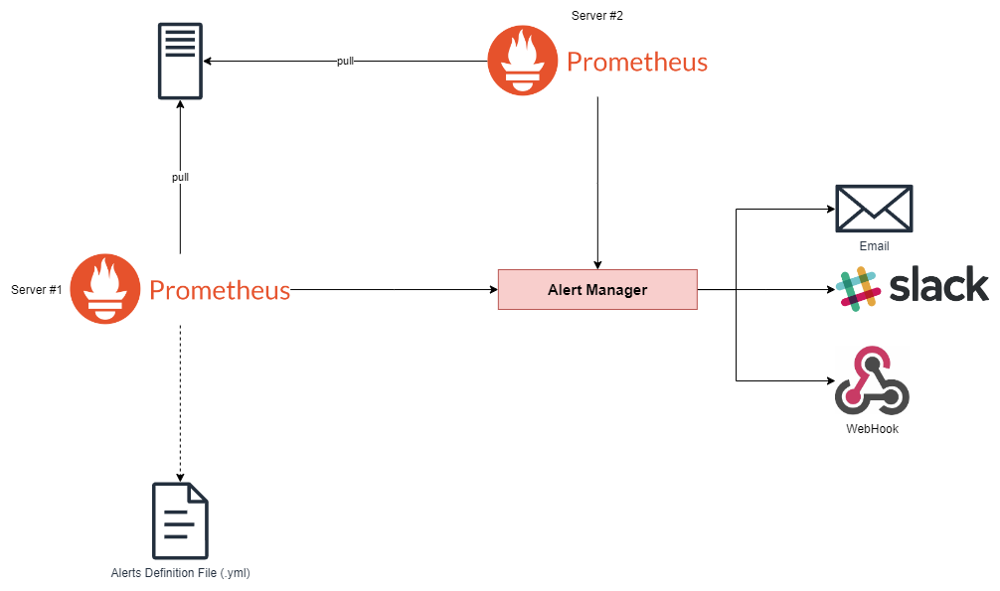
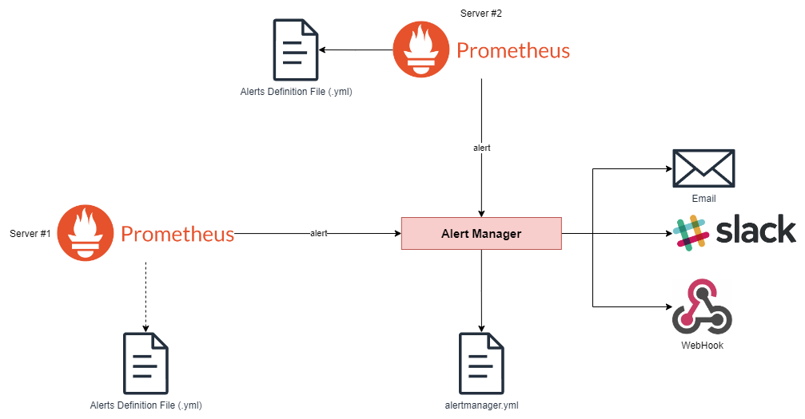
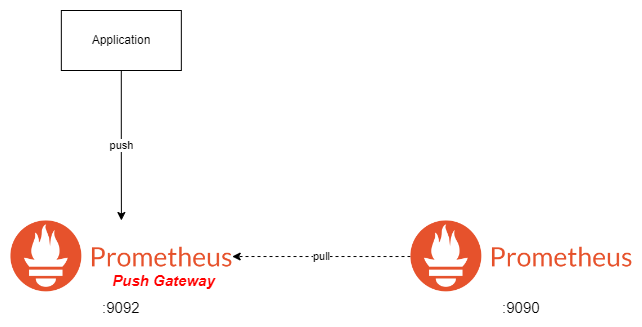

# Grafana overview <!-- omit in toc -->

## Contents <!-- omit in toc -->

- [1. Observability](#1-observability)
  - [1.1. What Data to Collect](#11-what-data-to-collect)
  - [1.2. What is Time Series data?](#12-what-is-time-series-data)
  - [1.3. Whats is a Time Series Database?](#13-whats-is-a-time-series-database)
  - [1.4. How is Time Series data collected?](#14-how-is-time-series-data-collected)
  - [1.5. How is data pushed to a TSD?](#15-how-is-data-pushed-to-a-tsd)
- [2. Telemetry](#2-telemetry)
  - [2.1. What is Telemetry?](#21-what-is-telemetry)
  - [2.2. Examples of Telemetric Data](#22-examples-of-telemetric-data)
  - [2.3. What's is the challenge?](#23-whats-is-the-challenge)
- [3. Grafana](#3-grafana)
  - [3.1. Alerts in Grafana](#31-alerts-in-grafana)
  - [3.2. Integrations](#32-integrations)
    - [3.2.1. Amazon CloudWatch](#321-amazon-cloudwatch)
  - [3.3. Administration](#33-administration)
- [4. Prometheus](#4-prometheus)
  - [4.1. Third-party exporters](#41-third-party-exporters)
  - [4.2. Retrieving Metrics](#42-retrieving-metrics)
    - [4.2.1. Data Model](#421-data-model)
    - [4.2.2. Data Types](#422-data-types)
      - [4.2.2.1. Scalar](#4221-scalar)
      - [4.2.2.2. Instant Vectors](#4222-instant-vectors)
      - [4.2.2.3. Range Vectors](#4223-range-vectors)
    - [4.2.3. Opeators](#423-opeators)
    - [4.2.4. Comparison Binary Operators](#424-comparison-binary-operators)
    - [4.2.5. Set Binary Operators](#425-set-binary-operators)
    - [4.2.6. Aggregation Operators](#426-aggregation-operators)
  - [4.3. Functions](#43-functions)
  - [4.4. Alerting](#44-alerting)
    - [4.4.1. Alert Manager](#441-alert-manager)
  - [4.5. Recording Rules](#45-recording-rules)
  - [4.6. Service Discovery](#46-service-discovery)
  - [4.7. Push Gateway](#47-push-gateway)
  - [4.8. Node Exporter](#48-node-exporter)
  - [4.9. Scraping Wintows Metrics](#49-scraping-wintows-metrics)
  - [4.10. Authentication](#410-authentication)
    - [4.10.1. Command to enable SSL / HTTPs](#4101-command-to-enable-ssl--https)
    - [4.10.2. Securing Push Gateway HTTPs + Auth](#4102-securing-push-gateway-https--auth)
    - [4.10.3. Securing Alert Manager](#4103-securing-alert-manager)
- [5. Tips \& Tricks](#5-tips--tricks)
  - [5.1. Docker](#51-docker)
  - [5.2. Dotnet MetricServer](#52-dotnet-metricserver)

# 1. Observability

- Observability is **understanding** or inferring the **internal state** and behavior of a system from its **external outputs**.
- In the context of software engineering, observability refers to the ability to **monitor** and understand the behavior of a software application in **real-time**, especially in **production** environments.

## 1.1. What Data to Collect

1. **Logs:** Record of events in a system.
2. **Metrics:** Also know as Telemetry Data.
   - Measurement of system's performance. i.e., CPU usage.
3. **Traces:** Traces are records of a request as it moves through the system.

## 1.2. What is Time Series data?

- A piece of data that has the following attributes:
  1. **Timestamp:** When data was stored?
  2. **Metric or Name:** What data is this?
  3. **Value:** The value of the data.
- Example:
  | Timestamp | Metric Name | Value |
  |-----------|-------------|-------|
  | CPU Usage | 13:56:20 | 63 |

## 1.3. Whats is a Time Series Database?

- A time series database can:
  1. Store the time series data.
  2. Has special functions to work with time series data.
  3. Has special query language to query time series data.
  4. Its performamce is tuned for working with time series data.
- Examples of Time Series databases:
  - **Primetheus** - Arguably the most common TSD (Time Series Database).
  - **InfluxDB** - High performance read and write.
  - **Graphite** - Original TSD of Grafana.
  - **Amazon Timestream (AWS)** - TSD on AWS.

## 1.4. How is Time Series data collected?

1. **Push:** Data is written to the database.
2. **Scrape:** Data is read by the database.

---

1. Example of Push TSD: Graphite and InfluxDB.
2. Example of a Scrape-based TSD: Prometheus.

## 1.5. How is data pushed to a TSD?

- Use of a **Network Daemon** or **Agent**.
- Example:
  - **StatsD:** Network daemon for collecting and aggregating data from different sources and pushing it to Graphite.
  - **Telegraf:** Data collector agent for InfluxDB that is used for collecting and aggregating dfata from different sources and pushing it to InfluxDB.
  - **Fluentd:** Fluentd is an open-source data collector that is designed for collecting and forwarding logs, events, and metrics from various sources.
  - **OpenTelemetry:** Set of tools and APIs to collect and forward data.

# 2. Telemetry


## 2.1. What is Telemetry?

- Telemetry is the automatic recording and transmission of data from remote or inaccessible sources to an IT system in a different location form monitoring and analysis.
- In software refers to the collection of business and diagnosis data from the software in production, and store and visualise it for the purpose of diagnosing production issues or improving the business.

## 2.2. Examples of Telemetric Data

- Average of time taken to connect to a database over time.
- The number of received orders per minute.
- The average value of refunds per day.
- How many erros and exceptions?
- What is the response time?
- How many times api is called?
- How many servers?
- How many users from Brazil?

## 2.3. What's is the challenge?

- Organizations rely more and more on telemetric data.
- Companies want to bring different data together.
- Telemetric data reside in different datasources.

# 3. Grafana

- Open-source software to:
  - Visualizes Time Series (telemetry) Data.
    - Time Series data has timestamps attached to it: One Order at 01/01/2022.
  - Brings data from different datasources together.
  - Defines alerts.
  - Is extensible through plugins.
  - Multi-organizational.

## 3.1. Alerts in Grafana

- Alerts are defined Graph Panel.
- Eachg Graph Panel can have one to many alerts.
- Alerts rise when a Rule is violated.
- A Rule indicates if a value on the graph is above or below a threshold.
- Rules are stored in and evaluated by Rule Engine.
  

## 3.2. Integrations

### 3.2.1. Amazon CloudWatch


- Configuration:
  
  

[Example CloudWatch CustomMetrics](https://github.com/jeftegoes/ExamplesUsingAwsSdk/tree/main/ExampleCloudWatchCustomMetrics)

## 3.3. Administration


# 4. Prometheus

- General view
  

## 4.1. Third-party exporters

- There are a number of libraries and servers which help in exporting existing metrics from third-party systems as Prometheus metrics.
- This is useful for cases where it is not feasible to instrument a given system with Prometheus metrics directly (for example, HAProxy or Linux system stats).

## 4.2. Retrieving Metrics

### 4.2.1. Data Model

- Prometheus stores data as **time series**.
- Every time series is identified by metric name and labels.
- Labels are a key and value pair.
- Labels are optional:
  - `<metric name> {key=value, key=value, ...}`
  - `auth_api_hit {count=1, time_taken=800}`

### 4.2.2. Data Types

- **PromQL** = rometheus Query Language.

#### 4.2.2.1. Scalar

- Float
- String
- Store
  - `prometheus_http_requests_total {code="200", job="prometheus"}`
  - Query
    - `prometheus_http_requests_total {code=~"2.*", job="prometheus"}`
    - `prometheus_http_requests_total {code=200, job="prometheus"}`

#### 4.2.2.2. Instant Vectors

- Instant vector selectors allow the selection of a set of time series and a single sample value for each at a given timestamp (instant).
- Only a metric name is specified.
- Result can be filered by providing labels.
- `auth_api_hit 1`
- `auth_api_hit {count=1, time_taken=800}`

#### 4.2.2.3. Range Vectors

- Range Vectors are similar to Instant Vectors except they select a range of samples.
  - `label_name[time_spec]`.
  - `auth_api_hit[5m]`.

### 4.2.3. Opeators

| Operator | Description    |
| -------- | -------------- |
| +        | Addition       |
| -        | Subtraction    |
| \*       | Multiplication |
| /        | Division       |
| %        | Modulo         |
| ^        | Power          |

- Scalar + Instant Vector.
  - Applies to every value of instant vector.
- Instant Vector + Instant Vector.
  - Applies to every value of left vector and its matching value in the right vector.

### 4.2.4. Comparison Binary Operators

| Operator | Description        |
| -------- | ------------------ |
| ==       | Equal              |
| !=       | Non-equal          |
| >        | Greater            |
| <        | Less-than          |
| >=       | Greater or Equal   |
| <=       | Less-than or Equal |

### 4.2.5. Set Binary Operators

- Set binary operators can be applied on Instant Vectors only.
  - `and`
  - `or`
  - `unless`

### 4.2.6. Aggregation Operators

- Aggregate the elements of a single Instant Vector.
- The result is a new Instant Vector with aggregated values.

| Operator     | Description                                                   |
| ------------ | ------------------------------------------------------------- |
| sum          | Calculates sum over dimensions                                |
| min          | Selects mininum over dimensions                               |
| max          | Selects maximum over dimensions                               |
| avg          | Selects average over dimensions                               |
| count        | Selects number of elements over dimensions                    |
| group        | Group elements. All values in resulting vector are equal to 1 |
| count_values | Counts the number of elements with the same values            |
| topk         | Largest elements by sample value                              |
| bottomk      | Smallest elements by sample value                             |
| stddev       | Finds population standard deviation over dimensions           |
| stdvar       | Finds population standard variation over dimensions           |

## 4.3. Functions

- Checks if an **Instant Vector** has any members Returns an empty vector if parameter has elements.
  - `absent(<Instant Vector>)`
- Checks if a **Range Vector** has any members Returns an empty vector if parameter has elements.
  - `absent_over_time(<Range Vector>)`
- Converts all values to their absolute value e.g., -5 to 5.
  - `abs(<Instant Vector>)`
- Converts all values to their nearest larger integer e.g.,1.6 to 2.
  - `ceil(<Instant Vector>)`
- Converts all values to their nearest smaller integer e.g., 1.6 to 1.
  - `flor(<Instant Vector>)`
- `clamp(<Instant Vector>, min, max)`
  - `clamp_min(<Instant Vector>, min)`
  - `clamp_max(<Instant Vector>, max)`
- For every UTC time returns day of month 1..31.
  - `day_of_month(<Instant Vector>)`
- For every UTC time returns day of week 1..7.
  - `day_of_week(<Instant Vector>)`
- Can only be used with **Gauges**.
  - `delta(<Instant Vector>)`
- Returns the difference between first and las items.
  - `idelta(<Range Vector>)`
- Returns binary logarithm of each scalar value.
  - `log2(<Instant Vector>)`
- Returns decimal logarithm of each scalar value.
  - `log10(<Instant Vector>)`
- Returns neutral logarithm of each scalar value.
  - `in(<Instant Vector>)`
- Sort elements in ascending order.
  - `sort(<Instant Vector>)`
- Sort elements in descending order.
  - `sort_desc(<Instant Vector>)`
- Returns the timestamp of each time segies (element).
  - `timestamp(<Instant Vector>)`
- Returns the difference between first and las items.
  - `idelta(<Range Vector>)`
- Returns the average of items in a range vector.
  - `avg_over_time(<Range Vector>)`
- Returns the sum of items in a range vector.
  - `sum_over_time(<Range Vector>)`
- Returns the minimum of items in a range vector.
  - `min_over_time(<Range Vector>)`
- Returns the maximum of items in a range vector.
  - `max_over_time(<Range Vector>)`
- Returns the count of items in a range vector.
  - `count_over_time(<Range Vector>)`

## 4.4. Alerting



### 4.4.1. Alert Manager

- Converts alerts to notifications.
- Can receibe alerts from multiple Prometheus servers.
- Can de-duplicate alerts.
- Can silent alerts.
- It has a web user interface.
- The web user interface is access via port 9093.
- Is configuerd via `alertmanager.yml` file.



## 4.5. Recording Rules

- Computed metrics:
  - `avg`
  - `sum`
  - `count`
- Rules are defined in .yml files.
- In linux-based operating systems put .yml files in /etc/prometheus/rules.
- In other operating syustems put .yml files in a folder i.e. "rules".

## 4.6. Service Discovery

- Prometheus provides a generic HTTP Service Discovery, that enables it to discover targets over an HTTP endpoint.
- The HTTP Service Discovery is complimentary to the supported service discovery mechanisms, and is an alternative to File-based Service Discovery.

## 4.7. Push Gateway

- A push gateway is a component of Prometheus.
  - It's part of Prometheus, which what it does basically is that it acts as temporary storage, where application can send the metric to it.
  - 
- Implementation detail
  - 

## 4.8. Node Exporter

- Every UNIX-based kernel e.g. computer is called a Node.
- **Node Exporter** is an official Prometheus exporter for collecting metrics that are exposed by Unix-based kernls e.g. Linux and Ubuntu.
- Example of metrics are CPU, Disk, Memory and Network I/O.
- **Node Exporter** can be extended with pluggable metric collectors.

## 4.9. Scraping Wintows Metrics

- There is no official Prometheus exporter for Windows.
- WMI: Windows Management Instrumentation.
  - **Infrasctructure for management data and operations on Windows-based operating systems.**
- WMS Exporter is a third-party Prometheus exporter for Windows.

## 4.10. Authentication

- There are many aspects to protect when we think about Prometheus, like:
- Securing Web UI.
- Securing Push Gateway.
- Securing Exporters.
- Securing Alert Manager.

### 4.10.1. Command to enable SSL / HTTPs

`openssl req -new -newkey rsa:2048 -days 365 -nodes -x509 -keyout node_exporter.key -out node_exporter.crt -subj "/C=BE/ST=Antwerp/L=Brasschaat/O=Inuits/CN=localhost" `

### 4.10.2. Securing Push Gateway HTTPs + Auth

- Basic auth:

```
  - job_name: "pushgateway"
    scheme: https
    tls_config:
      ca_file: /usr/local/etc/prom.crt
      server_name: 'localhost'
    basic_auth:
      username: admin
      password: password
    static_configs:
    - targets: ["localhost:9091"]
```

- Example pushgateway.yml:

```
  tls_server_config:
    cert_file: /usr/local/etc/prom.crt
    key_file:  /usr/local/etc/prom.key

  basic_auth_users:
    admin: <my_key>
```

- Command to start with web.yml
  - `./pushgateway --web.config.file=/usr/local/etc/pushgateway.yml`

### 4.10.3. Securing Alert Manager

- Example prometheus.yml:
  ```
    alerting:
      alertmanagers:
      - scheme: https
        tls_config:
          ca_file: /usr/local/etc/prom.crt
          server_name: 'localhost'
        basic_auth:
          username: admin
          password: password
      - static_configs:
        - targets:
          - localhost:9093
  ```

# 5. Tips & Tricks

## 5.1. Docker

- Since the targets are not running inside the prometheus container, they cannot be accessed through localhost.
- You need to access them through the host private IP or by replacing localhost with `docker.for.mac.localhost` or `host.docker.internal`.
  - On Windows:
    - `host.docker.internal` (tested on win10, win11)
  - On Mac
    - `docker.for.mac.localhost`
  - Example:
  ```
    - job_name: "pushgateway"
      static_configs:
        - targets: ["host.docker.internal:9092"]
  ```

## 5.2. Dotnet MetricServer

- To avoid this error _Unhandled exception. System.Net.HttpListenerException (5): Access is denied_.
  - Run this command `netsh http add urlacl url=http://+:8008/ user=Everyone listen=yes` as administrator.
