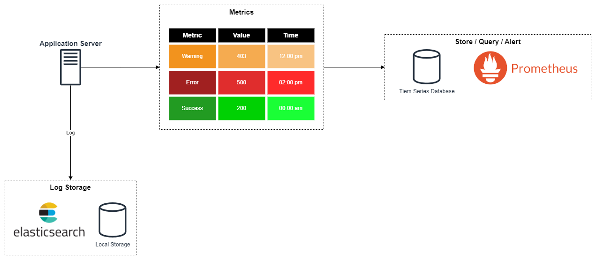
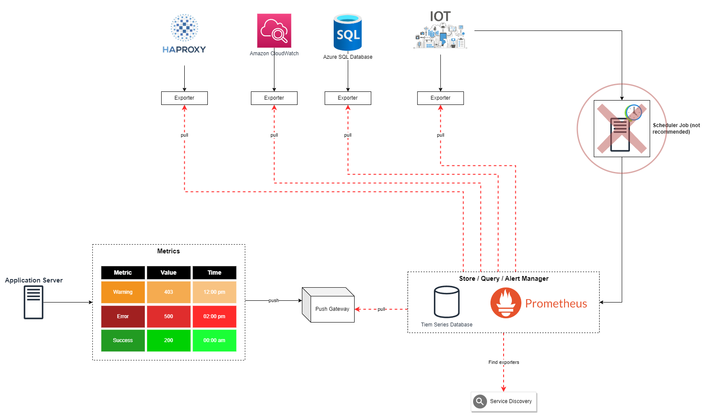
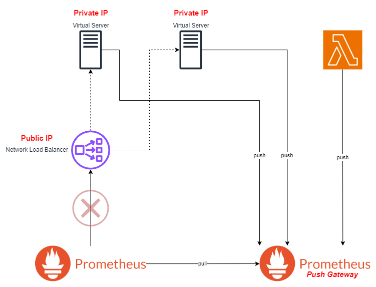

# Grafana overview <!-- omit in toc -->

## Contents <!-- omit in toc -->

- [1. Telemetry](#1-telemetry)
  - [1.1. What is Telemetry?](#11-what-is-telemetry)
  - [1.2. Examples of Telemetric Data](#12-examples-of-telemetric-data)
  - [1.3. What's is the challenge?](#13-whats-is-the-challenge)
- [2. Grafana](#2-grafana)
  - [2.1. Alerts in Grafana](#21-alerts-in-grafana)
  - [2.2. Integrations](#22-integrations)
    - [2.2.1. AWS CloudWatch](#221-aws-cloudwatch)
  - [2.3. Administration](#23-administration)
- [3. Prometheus](#3-prometheus)
  - [3.1. Push Gateway](#31-push-gateway)
  - [3.2. Node Exporter](#32-node-exporter)
  - [3.3. Scraping Wintows Metrics](#33-scraping-wintows-metrics)
  - [3.4. Authentication](#34-authentication)
- [4. Tips \& Tricks](#4-tips--tricks)

# 1. Telemetry



## 1.1. What is Telemetry?

- Telemetry is the automatic recording and transmission of data from remote or inaccessible sources to an IT system in a different location form monitoring and analysis.
- In software refers to the collection of business and diagnosis data from the software in production, and store and visualise it for the purpose of diagnosing production issues or improving the business.

## 1.2. Examples of Telemetric Data

- Average of time taken to connect to a database over time.
- The number of received orders per minute.
- The average value of refunds per day.
- How many erros and exceptions?
- What is the response time?
- How many times api is called?
- How many servers?
- How many users from Brazil?

## 1.3. What's is the challenge?

- Organizations rely more and more on telemetric data.
- Companies want to bring different data together.
- Telemetric data reside in different datasources.

# 2. Grafana

- Visualizes Time Series (telemetry) Data.
  - Time Series data has time stamps attached to it: One Order at 01/01/2022.
- Brings data from different datasources together.
- Defines alerts.
- Is extensible through plugins.

## 2.1. Alerts in Grafana

- Alerts are defined Graph Panel.
- Eachg Graph Panel can have one to many alerts.
- Alerts rise when a Rule is violated.
- A Rule indicates if a value on the graph is above or below a threshold.
- Rules are stored in and evaluated by Rule Engine.


## 2.2. Integrations

### 2.2.1. AWS CloudWatch


## 2.3. Administration


# 3. Prometheus



- **Push gateway**
  - A push gateway is a component of Prometheus.
    It's part of Prometheus, which what it does basically is that it acts as temporary storage, where application can send the metric to it.
- **Third-party exporters**
  - There are a number of libraries and servers which help in exporting existing metrics from third-party systems as Prometheus metrics.
  - This is useful for cases where it is not feasible to instrument a given system with Prometheus metrics directly (for example, HAProxy or Linux system stats).

## 3.1. Push Gateway



## 3.2. Node Exporter

- Every UNIX-based kernel e.g. computer is called a Node.
- **Node Exporter** is an official Prometheus exporter for collecting metrics that are exposed by Unix-based kernls e.g. Linux and Ubuntu.
- Example of metrics are CPU, Disk, Memory and Network I/O.
- **Node Exporter** can be extended with pluggable metric collectors.

## 3.3. Scraping Wintows Metrics

- There is no official Prometheus exporter for Windows.
- WMI: Windows Management Instrumentation.
  - **Infrasctructure for management data and operations on Windows-based operating systems.**
- WMS Exporter is a third-party Prometheus exporter for Windows.

## 3.4. Authentication

# 4. Tips & Tricks

- Since the targets are not running inside the prometheus container, they cannot be accessed through localhost.
- You need to access them through the host private IP or by replacing localhost with `docker.for.mac.localhost` or `host.docker.internal`.
  - On Windows:
    - `host.docker.internal` (tested on win10, win11)
  - On Mac
    - `docker.for.mac.localhost`
  - Example:
  ```
    - job_name: "pushgateway"
      static_configs:
        - targets: ["host.docker.internal:9092"]
  ```
